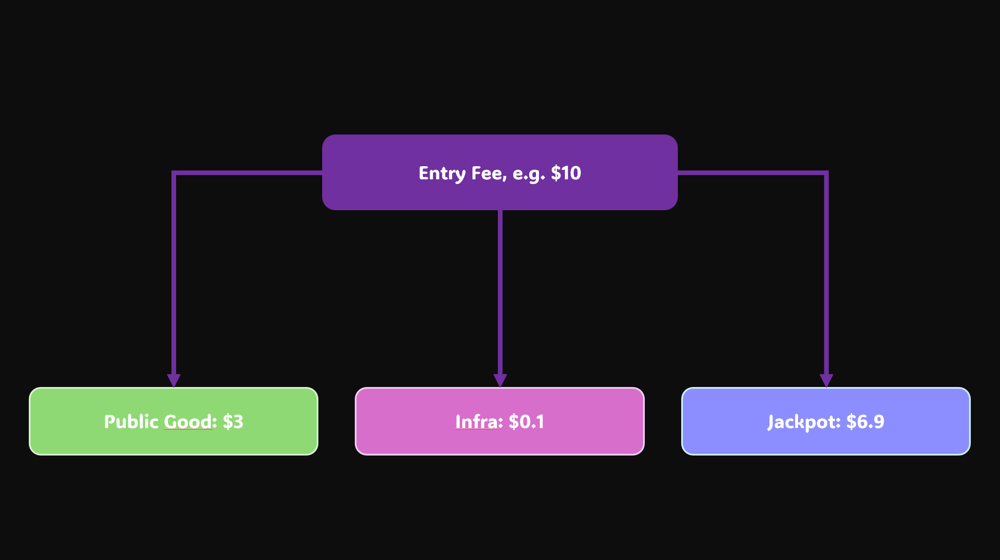

# [PLottoPGF]

- **Track:** Public Goods | Applied Encryption
- **Team/Contributors:** Danish | nodestarQ
- **Repository:** [PLottoPGF repository](https://github.com/nodestarQ/hackathon-2025-berlin-submissions)
- **Demo:** [Link to live demo, video, or screenshots]

## Description (TL;DR)
PLottoPGF ( **P**rivate **L**otto for **P**ublic **G**oods **F**unding) is a privacy-preserving number lottery (Lotto) to fund publics goods. Inspired by [lottopgf](https://lottopgf.org/), it lets participants play without revealing personal details—no one knows who’s playing, who wins, or when the money’s withdrawn. And the best part? Some of the ticket fees go towards funding public goods! (yay!!!)

TL;DR: Incentivizing "degens" to donate for public goods in a private and fair way! :D

## Problem
Public goods are vital but often struggle to secure steady funding. Traditional models like government subsidies or donation campaigns just don't cut it, and private donations are unpredictable. In the lottery world (including OG LottoPGF), transparency usually means revealing who plays, who wins, and transaction details—which, while important for accountability, raises privacy concerns. This often deters people from participating, either in lotteries or in donation-based funding for public goods.

At the same time, the "degen" crowd in DeFi is all about taking high risks for high rewards, chasing massive jackpots. What if we could tap into that energy to fund public goods without them even realizing it? This is where PLottoPGF comes in.

## Solution 
PLottoPGF tackles these issues by offering a privacy-focused lottery that ensures anonymity for all participants. A portion of every ticket (30%) goes towards public goods funding, 1% helps maintain the platform, and 69% (nice) goes into the jackpot, with one lucky winner taking it all!

We use Aztec for privacy, ensuring identities, winnings, and transaction details remain hidden. This way, PLottoPGF leverages the degen community’s love for gambling while ensuring a privacy-conscious, decentralized platform that also funds public goods.

Anyrand will be used for fair and random lottery outcomes and paired with the feistelshuffle implementation in NOIR this will not only be cheaper to accomplish but will also scale very well!

## Technology Stack
- [Aztec](https://aztec.network/) and [NOIR](https://aztec.network/noir): Privacy protocol and smart contract language for private transactions and applications (used for the lottery system’s privacy).

- [Obsidion](https://obsidion.xyz/) (Aztec Wallet): Privacy-focused wallet for interacting with Aztec's privacy features.

- [Anyrand](https://anyrand.com/) for VRF: Provides Verifiable Random Functions to ensure fair and provably random lottery outcomes.

- [Svelte](https://svelte.dev/) for frontend: Framework for building fast, reactive user interfaces.

## Privacy Impact
PLottoPGF ensures complete privacy by using Aztec's zero-knowledge proof technology and NOIR for executing private smart contracts. Unlike traditional lotteries, where participants' identities and transaction details are public, we keep everything confidential. Players identities, ticket purchases, and jackpot winnings are all hidden, so no one can trace who’s involved or when funds are withdrawn. This guarantees a fun, decentralized experience with total anonymity. Public goods funders also stay anonymous, so there’s no risk of unwanted scrutiny for receiving support.

## Real-World Use Cases
- **Privacy-Conscious Individuals**:
People who want to participate in a lottery but don't want to expose their identity or financial details can use PLottoPGF to play completely anonymously.

- **"Crypto Degens"**:
DeFi's risk-loving crowd can satisfy their gambling instincts by playing the lottery, knowing that part of their stake is going toward funding public goods. It’s high-stakes, high-reward and the bonus is they’re helping out without even thinking about it.

- **Public Goods Funders**:
Non-profits or projects that rely on public donations can benefit from a decentralized, privacy-respecting platform for generating funds, without needing to manage individual donors or expose sensitive data.

- **Casual Lottery Players**:
While the platform is built for the crypto world, it’s designed to be intuitive enough for regular folks who enjoy lotteries too. With a user-friendly UI/UX, it could be easily adopted outside of crypto circles, though there may be legal considerations around private lotteries. 

## Business Logic
PLottoPGF leverages the popularity of lotteries and DeFi culture to fund public goods. Here's how it works: participants buy tickets for a privacy-preserving lottery, and a portion of each ticket fee is directed towards public goods. A small percentage is also used to cover platform infrastructure costs. The rest goes into the jackpot, which one lucky winner takes home.

Here’s an example of how the ticket fee might be split:

This incentivizes high participation while making sure meaningful contributions are being made to public goods funding.

## What's Next
The idea for this project came about pretty last-minute—after hearing that the original LottoPGF creators struggled to raise enough funds to pursue their vision full-time. I thought, why not add privacy to the mix and give it a second life?

Next steps: finish up the code, get an MVP working on Aztec’s Testnet, and let people test it out. We’ll be looking for vulnerabilities in the code and system, diving deeper into NOIR, and improving the Feistel shuffle implementation. There’s still a lot to do, but it’s going to be fun!